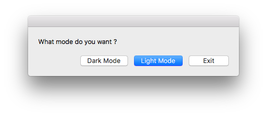
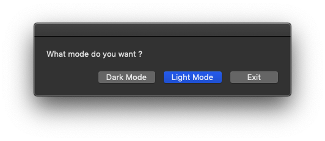
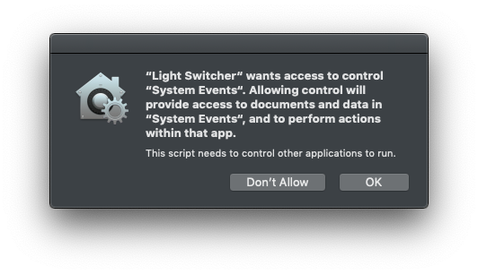

# Light-switcher

A modest AppleScript that enables the easy switch between macOS "light" and "dark" built-in modes (Mojave compatible).

# Use

- **Possiblity 1**: Download and lauch the script via Script Editor (`.scpt` file) 
- **Possibility 2**: Download the released `.app` [here](https://github.com/f-dufour/light-switcher/releases/latest), lock it in your dock,  and choose your mode !

*Notice: The system may alert you that Light Switcher wants access to control System Events. Click OK to make it work. It relies on System events to switch modes:*

# TO DO

- [ ]  Add a switch in the menu bar (is that even possible with AppleScript?)
