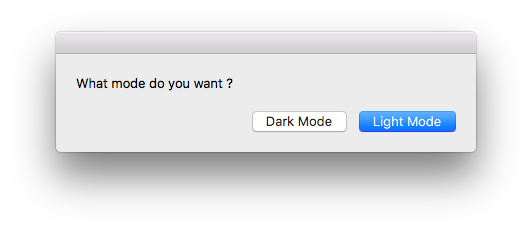

# Light-switcher

A modest Apple Script that enables the easy switch between macOS "light" and "dark" built-in modes.

# Use

Lauch the script via Script Editor (.scpt file) or the compiled app (.app file) and choose your mode !

Note that the compiled app is dockable.

# TO DO

* Add a switch in the upper banner of the screen (that way, it will be easily accessible).
